### Eloquent  ORM One to One Reverse Relation Laravel - 9
<b>Project Description</b>  
Here I created E-commerce Product Category & Sub-Category relation.
with eloquent one to one reverse object relation mapping.  

<b>Project Features</b>  
 1. Product  Category
 2. Product Sub Category
 3. ORM
 4. CRUD
 
 <b>Project Demo</b>  
   Click on image to view the demo picture clearly
   
 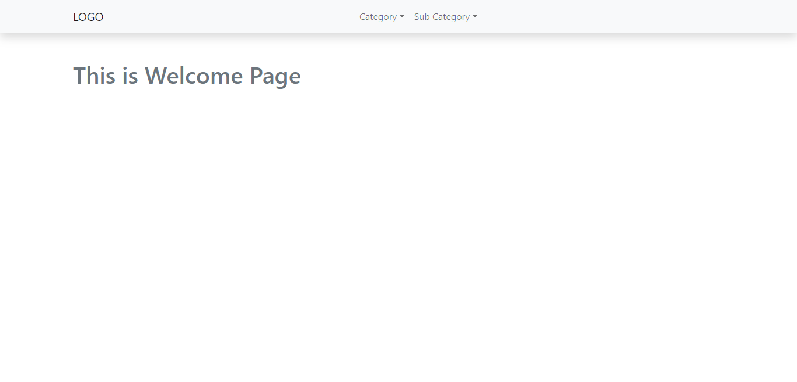
 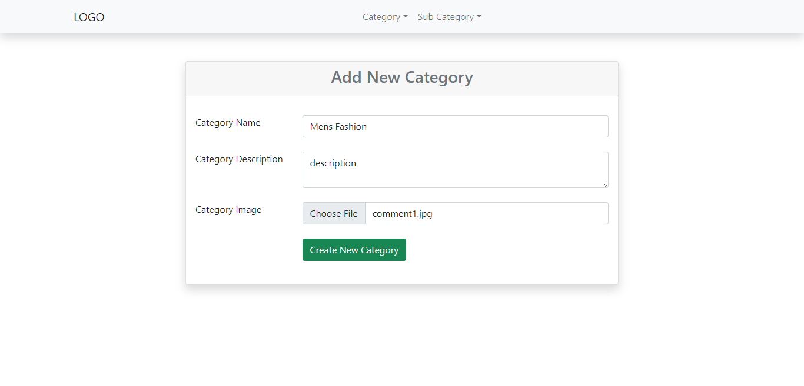
 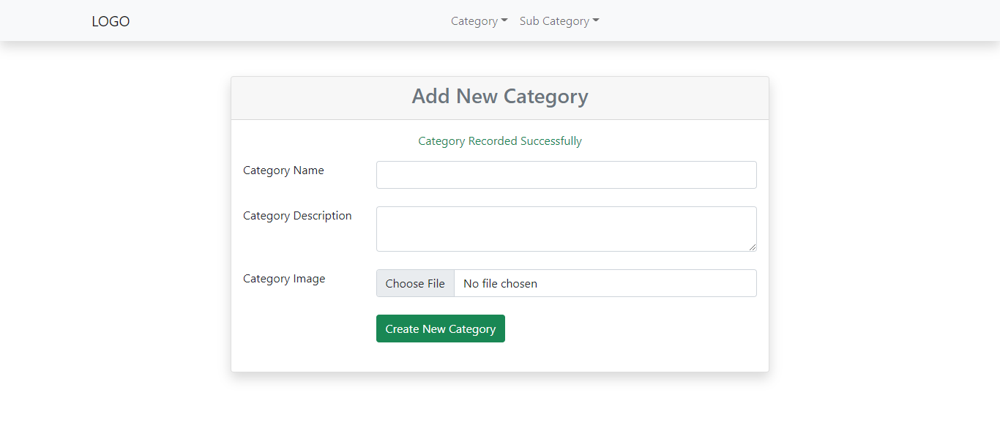
 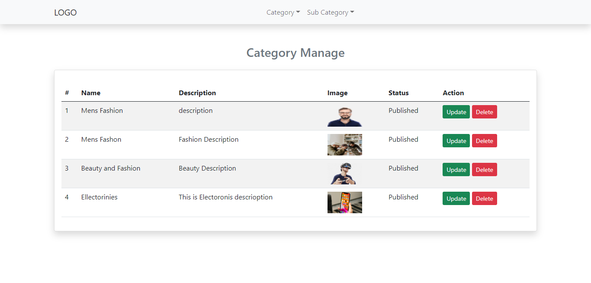
 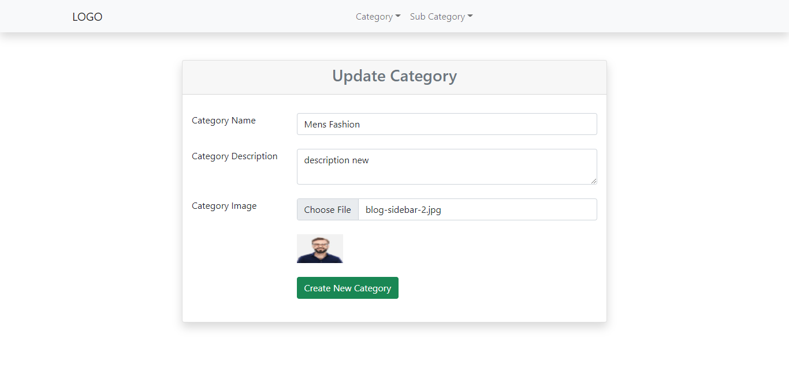
 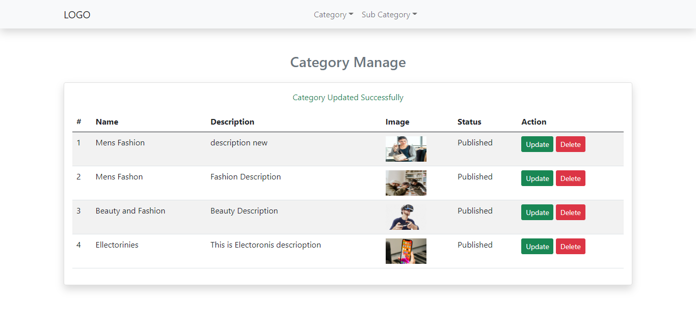
 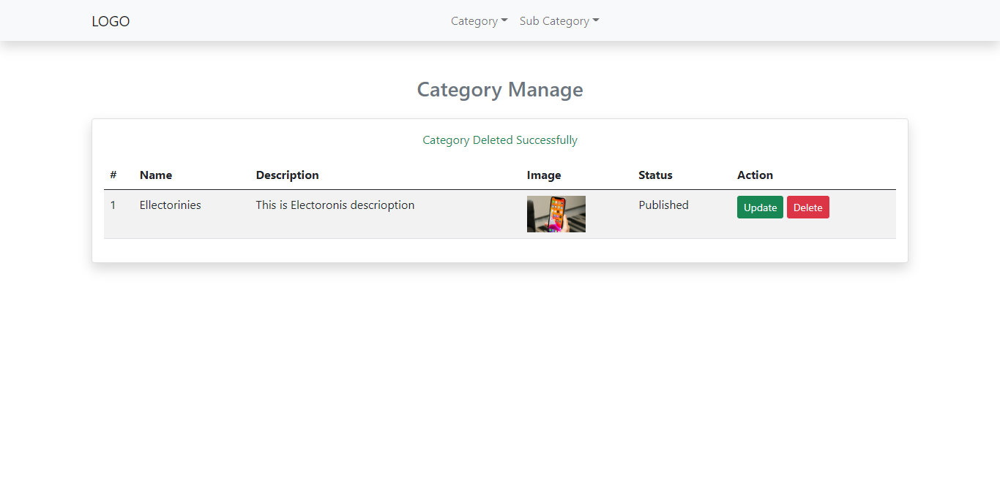
 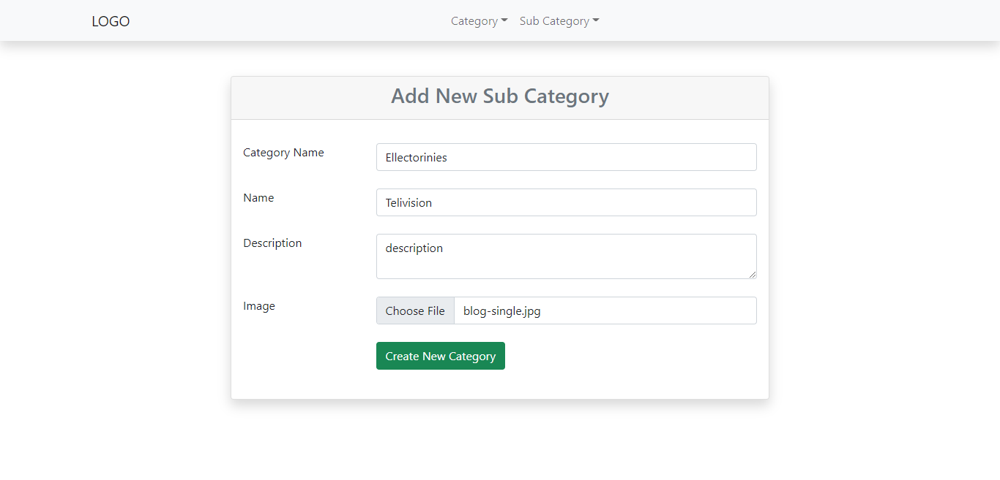
 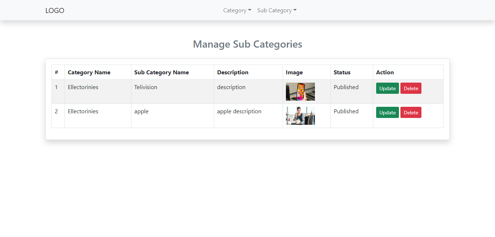
 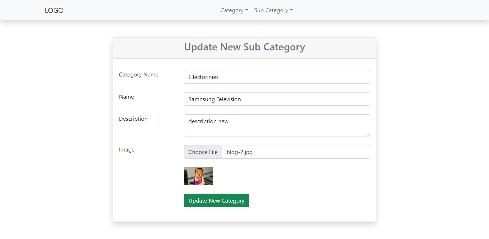
 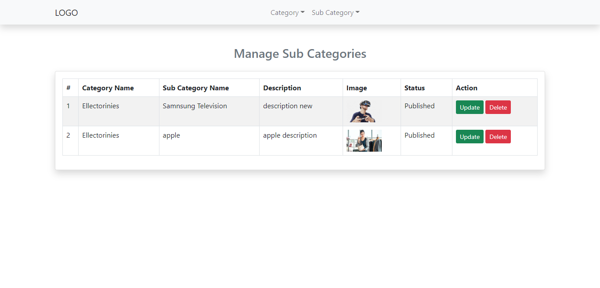
 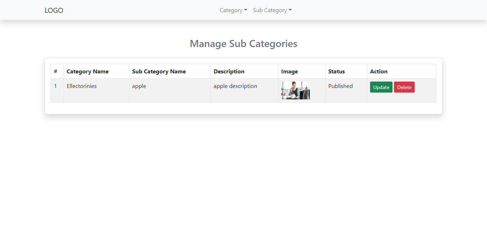
 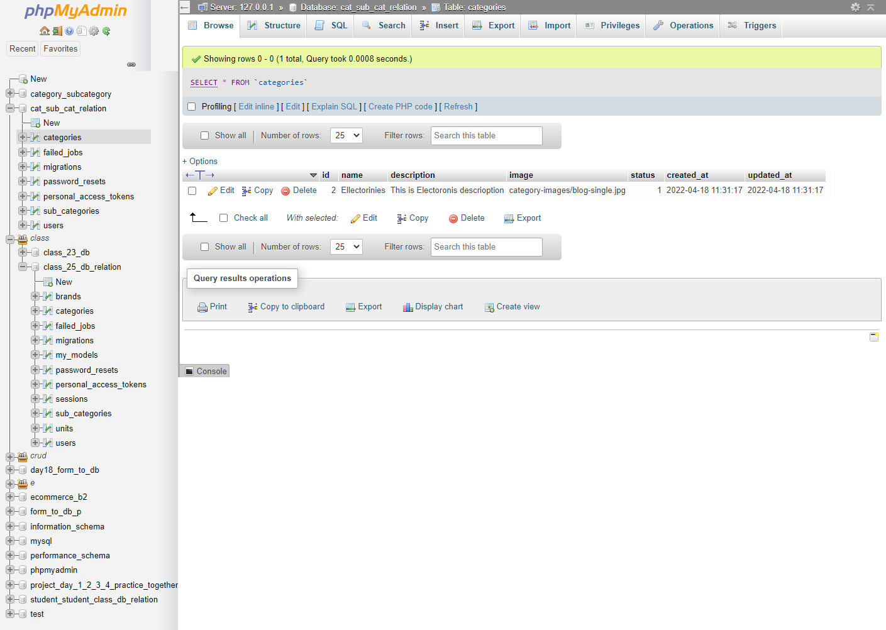
 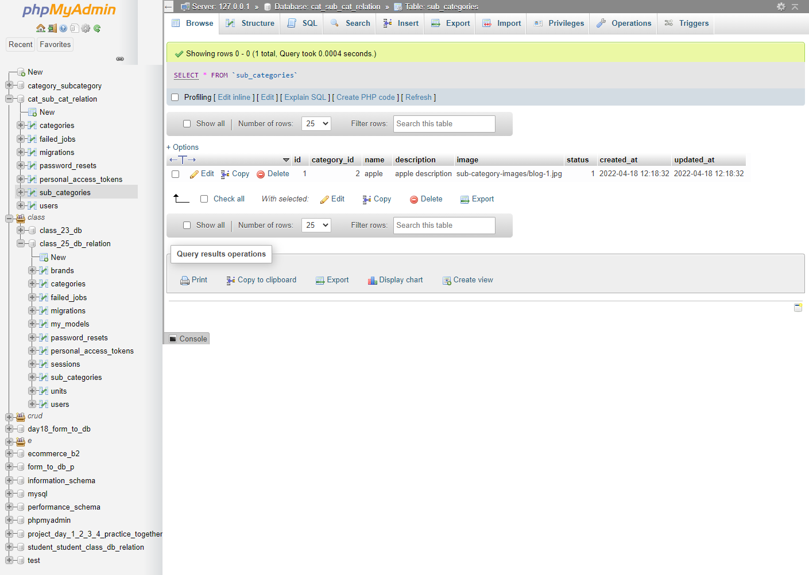

  <b>Technologies Use</b>  
    1. Laravel - 9  
    2. MySQL
    
   <b>Project Developer</b>  
   Name: <b>Mazharul Islam</b>  
   Professional Full Stack Web Developer  
   Email: <i>mazharulislam1998r@gmail.com</i>  
   Cell: +8801638574281  
   
   Thanks.
   
   
    
  
  

